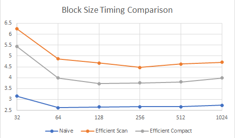
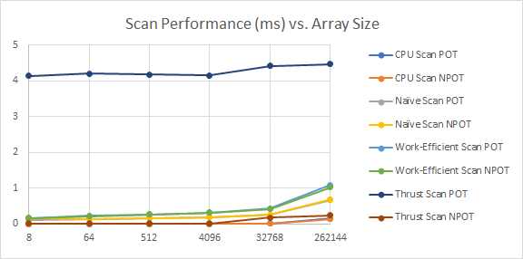
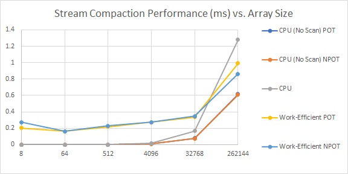
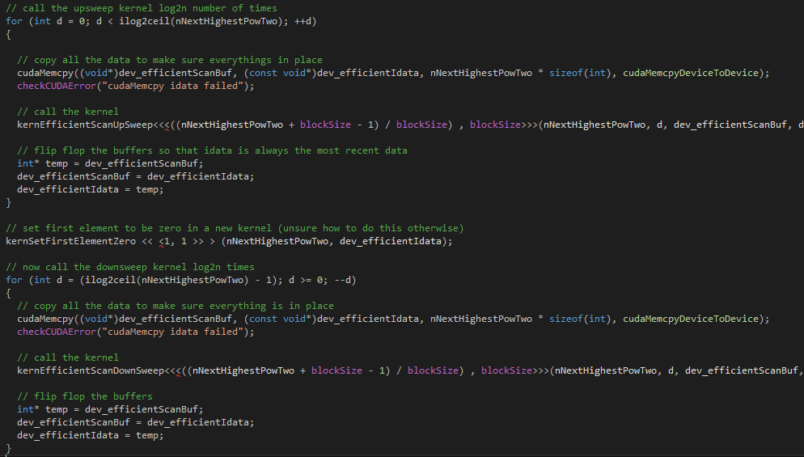

CUDA Stream Compaction
======================

**University of Pennsylvania, CIS 565: GPU Programming and Architecture, Project 2**

* Liam Dugan
  * [LinkedIn](https://www.linkedin.com/in/liam-dugan-95a961135/), [personal website](http://liamdugan.com/)
* Tested on: Windows 10, Ryzen 5 1600 @ 3.20GHz 16GB, GTX 1070 16GB (Personal Computer)


# Stream Compaction
This homework is an introduction to implementing and optimizing parallel algorithms on the GPU. To do this we were tasked with writing a CPU implementation and various GPU implementations and comparing their timing results.

## Features Completed
* CPU Scan and stream compaction implementation
* GPU Naive scan implementation
* GPU Work efficient scan and stream compaction implementation
* Wrapper for Thrust compaction

# Questions
### Roughly optimize the block sizes of each of your implementations for minimal run time on your GPU
I tested block sizes from 32 up to 1024 in power of two increments and determined that a block size of 64 was ideal for the naive implementation and a block size of 128 was ideal for the work-efficient implementations.

For the timing results, an array of size 2^20 (~1 million) was tested while changing the block size. Time is in miliseconds.



### Compare all of these GPU Scan implementations (Naive, Work-Efficient, and Thrust) to the serial CPU version of Scan. Plot a graph of the comparison (with array size on the independent axis).





### Write a brief explanation of the phenomena you see here.
I believe the main performance bottleneck in my scan code is undoubtedly the memory accesses. In both my naive and work efficient scan implementations I write to global memory after every level of the tree is traversed (i.e. log(n) times). This is significantly slower than using shared memory, which would only write to global memory log(n / blocksize) times.

Additionally, in my work efficient scan algorithm I use ping-pong buffers,but memcpy the data between buffers on every cycle of both the upsweep and the downsweep of the algorithm. Since I do not have to do this in my naive implementation, I believe that is why my work efficient scan is slower.



For the thrust scan, the reason why I believe the power of two array test runs so much slower than the non power of two code is due to some sort of internal thrust library bookkeeping. I believe once a thrust function is called, there is some sort of one-time-only process to initialize thrust specific state. Thus when we call the power-of-two length array thrust scan it has to take that extra set up time, but once we call the non power of two code, all the setup has already been completed and it can run quickly.


### Test Program Output

```

****************
** SCAN TESTS **
****************
    [  12   6  12  29  23  44  41  42  46  40   9  23  22 ...   6   0 ]
==== cpu scan, power-of-two ====
   elapsed time: 1.47776ms    (std::chrono Measured)
    [   0  12  18  30  59  82 126 167 209 255 295 304 327 ... 51356118 51356124 ]
==== cpu scan, non-power-of-two ====
   elapsed time: 1.57856ms    (std::chrono Measured)
    [   0  12  18  30  59  82 126 167 209 255 295 304 327 ... 51356052 51356083 ]
    passed
==== naive scan, power-of-two ====
   elapsed time: 5.05549ms    (CUDA Measured)
    [   0  12  18  30  59  82 126 167 209 255 295 304 327 ... 51356118 51356124 ]
    passed
==== naive scan, non-power-of-two ====
   elapsed time: 5.13843ms    (CUDA Measured)
    [   0  12  18  30  59  82 126 167 209 255 295 304 327 ... 51356118 51356124 ]
    passed
==== work-efficient scan, power-of-two ====
   elapsed time: 9.00813ms    (CUDA Measured)
    [   0  12  18  30  59  82 126 167 209 255 295 304 327 ... 51356118 51356124 ]
    passed
==== work-efficient scan, non-power-of-two ====
   elapsed time: 8.82483ms    (CUDA Measured)
    [   0  12  18  30  59  82 126 167 209 255 295 304 327 ... 51356052 51356083 ]
    passed
==== thrust scan, power-of-two ====
   elapsed time: 4.64384ms    (CUDA Measured)
    [   0  12  18  30  59  82 126 167 209 255 295 304 327 ... 51356118 51356124 ]
    passed
==== thrust scan, non-power-of-two ====
   elapsed time: 0.334848ms    (CUDA Measured)
    [   0  12  18  30  59  82 126 167 209 255 295 304 327 ... 51356052 51356083 ]
    passed

*****************************
** STREAM COMPACTION TESTS **
*****************************
    [   3   1   3   3   0   1   1   1   0   2   1   1   1 ...   3   0 ]
==== cpu compact without scan, power-of-two ====
   elapsed time: 5.27103ms    (std::chrono Measured)
    [   3   1   3   3   1   1   1   2   1   1   1   2   3 ...   3   3 ]
    passed
==== cpu compact without scan, non-power-of-two ====
   elapsed time: 5.21855ms    (std::chrono Measured)
    [   3   1   3   3   1   1   1   2   1   1   1   2   3 ...   3   3 ]
    passed
==== cpu compact with scan ====
   elapsed time: 12.4281ms    (std::chrono Measured)
    [   3   1   3   3   1   1   1   2   1   1   1   2   3 ...   3   3 ]
    passed
==== work-efficient compact, power-of-two ====
   elapsed time: 7.15469ms    (CUDA Measured)
    [   3   1   3   3   1   1   1   2   1   1   1   2   3 ...   3   3 ]
    passed
==== work-efficient compact, non-power-of-two ====
   elapsed time: 7.18848ms    (CUDA Measured)
    [   3   1   3   3   1   1   1   2   1   1   1   2   3 ...   3   3 ]
    passed
```